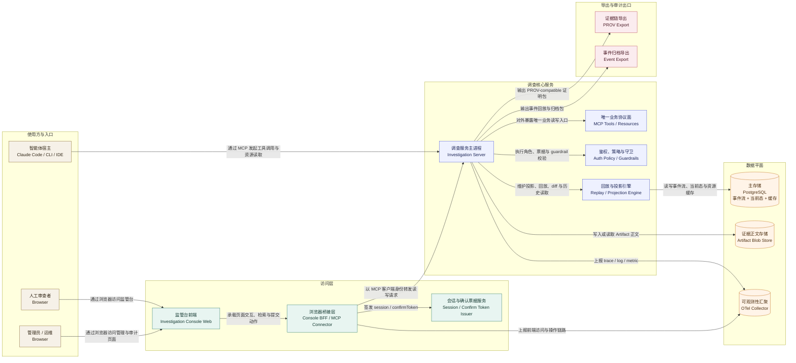
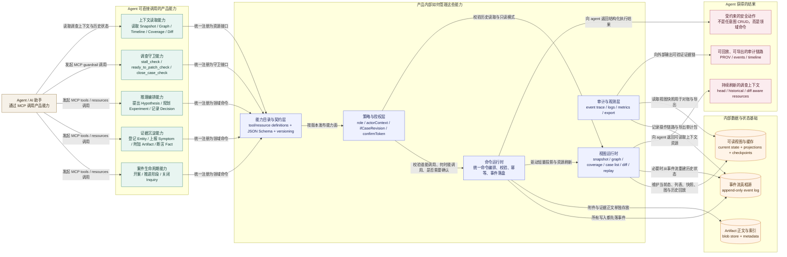
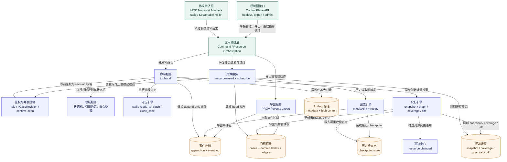
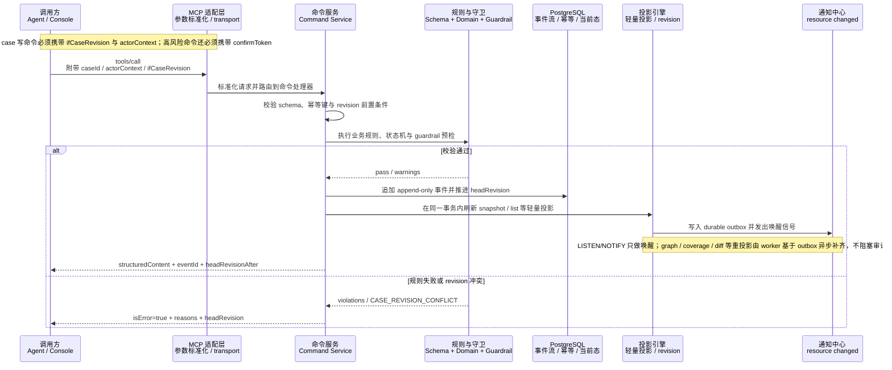
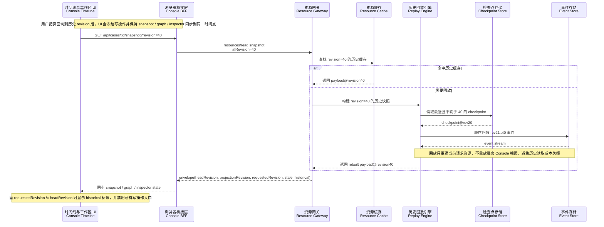
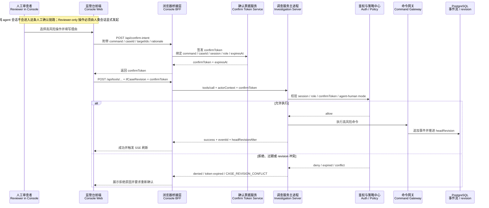

# COE for Agent 技术方案

## 1. 文档目标

本文基于 [docs/PRD/coe-for-agent-prd.md](/Volumes/XU-1TB-NPM/projects/COE-for-Agent/docs/PRD/coe-for-agent-prd.md)，给出 COE for Agent 的 MVP 技术落地方案。方案覆盖两部分：

- MCP-first 的 Investigation Server
- 面向人类审计与干预的 Investigation Console

本文解决的是“怎么实现”，不是“产品为什么做”。产品目标、对象定义和验收口径以 PRD 为准。

本版已经完成此前收口内容的并入，本文现在是该项目在 `docs/DEV` 下唯一的技术真相源，不再维护独立的补遗文档。

## 1.1 当前实现状态

截至当前仓库状态，本文中的 MVP 主链路已经有对应实现，不再只是设计草图。已落地的关键能力包括：

- Investigation Server 的 MCP tools/resources、事件流、projection、checkpoint + replay、guardrails、export 与 control plane 路由
- Investigation Console 的 Case List、Snapshot、Graph Slice、Timeline、Coverage、Guardrail、Inspector、Reviewer Action Panel
- history mode、revision diff、reviewer confirmToken、高风险写操作冻结
- OpenAPI control plane 资产、fixture-backed e2e、根级 typecheck/test/test:e2e 回归链路

因此，阅读本文时应把它理解成“当前实现遵循的技术真相源”，而不是一份尚未开始编码的前置设计文档。

## 2. 设计结论

MVP 采用两个 deployable：Investigation Server 和 Investigation Console。Server 负责 MCP 工具面、资源面、事件流、投影和 guardrail；Console 负责案件浏览、图切片、时间线、审计和受控写操作。

核心技术结论如下：

- 协议层：MCP 作为唯一业务读写标准面，OpenAPI 只保留健康检查、导出和管理操作。
- 写入模型：所有业务写入先落 append-only 事件，再更新当前态投影；不允许直接改图。
- 存储模型：MVP 使用 PostgreSQL 16 作为唯一主存储，Artifact 内容放对象存储或本地文件系统；不引入图数据库和外部消息队列。
- 服务实现：TypeScript + Node.js 22，统一服务端语言，最大化复用 MCP SDK、JSON Schema、OpenTelemetry 与前端共享类型。
- 前端实现：React + TypeScript 的 Web Console，前面接一个 BFF 连接器，把浏览器与 MCP 连接细节隔离开。
- Surface 约束：MVP 固定为 17 个变更型 tools、4 个 evaluation/guardrail tools、9 个 resource family。
- 一致性策略：除 `investigation.case.open` 外，所有现有 case 的写命令都必须携带 `ifCaseRevision`；读路径统一返回 revision-aware resource envelope。
- 回放策略：head 视图读当前态投影，历史视图按 `atRevision` 从 checkpoint + event replay 构建；`diff` 资源负责 revision 对比。
- 治理策略：Case List 走 MCP collection resource；Reviewer-only 高风险操作必须经过 `confirmToken`，且不对纯 agent 会话开放。
- 规范交付：MVP 必须交付 `spec/profile.md`、`spec/conformance.md`、`spec/events.md`、`spec/versioning.md` 以及最小 conformance fixtures。
- 实时性：MCP 资源通知经 Console BFF 转为 SSE，驱动页面增量刷新。

## 3. 范围与边界

### 3.1 MVP 范围

- 11 类领域对象的持久化与资源投影
- 17 个变更型 MCP tools、4 个 evaluation/guardrail tools、9 个 resource family
- Console 的 Case List、Snapshot、Graph Slice、Inspector、Timeline、Coverage、Guardrails、人工介入面板
- OTel trace/log/metric 基础埋点
- PROV-compatible 导出

### 3.2 明确不做

- A2A façade
- 图数据库专用存储
- 自动抽事实、自动给结论、自动推荐 patch
- 通用图编辑器能力
- 多人协同编辑与评论系统
- 富图布局持久化

## 4. 总体架构

为提升图示可读性，本文中的 Mermaid 图统一采用以下约定：

- 节点第一行写中文职责，第二行保留实现名、协议名或运行形态
- 连线标签尽量写清“谁以什么方式做什么动作”，避免只有抽象依赖关系
- 圆柱节点表示持久化存储，普通矩形节点表示运行时模块，子图表示职责边界或部署边界

先看系统上下文总览。该图重点回答三件事：谁在使用系统、唯一业务读写入口在哪里、数据面与导出面如何和核心业务解耦。



### 4.1 架构图视图集

这里用“1 张总览图 + 3 张细化图”的方式补足架构视角，分别回答四个问题：

- 谁在使用系统，系统边界在哪里
- 运行时各组件如何协作
- 本地与远程部署时拓扑如何变化
- 对外沟通时，agent 实际能调用什么能力，以及这些能力如何被内部统一管理

#### 4.1.1 运行时容器图

```mermaid
flowchart TB
  classDef ui fill:#F7F2E9,stroke:#8A6A2F,color:#2F2413;
  classDef bff fill:#E8F5F1,stroke:#2E7D6E,color:#11362E;
  classDef srv fill:#EEF1FF,stroke:#4F5BD5,color:#1A2354;
  classDef store fill:#FFF4E8,stroke:#C57725,color:#4A2C0C;

  subgraph Browser[浏览器工作台]
    UI[监管台工作区<br/>Case List / Snapshot / Graph / Timeline]
    RevisionBar[历史模式与 Revision 条<br/>只读状态 / diff 跳转]
  end

  subgraph BFF[Console BFF]
    QueryAPI[查询代理接口<br/>Query API]
    CommandAPI[命令代理接口<br/>Command API]
    StreamAPI[SSE 推送接口<br/>Stream API]
    TokenService[会话与确认服务<br/>Session / Confirm Token Service]
  end

  subgraph Server[Investigation Server]
    McpTransport[MCP 传输适配层<br/>stdio / Streamable HTTP]
    CommandGateway[命令网关<br/>tools/call orchestration]
    ResourceGateway[资源网关<br/>resources/read + subscribe]
    AuthPolicy[鉴权与策略中心<br/>role / actorContext / confirmToken]
    SchemaRules[结构与领域规则<br/>JSON Schema + Domain Rules]
    GuardrailEngine[守卫引擎<br/>stall / ready_to_patch / close_case]
    ProjectionEngine[投影引擎<br/>snapshot / graph / coverage / diff]
    ReplayEngine[历史回放引擎<br/>checkpoint + event replay]
    NotificationHub[资源变更通知中心<br/>resource changed]
    ExportService[导出服务<br/>PROV / events]
  end

  subgraph Storage[存储与索引]
    EventStore[(事件流表<br/>investigation_events)]
    DedupStore[(幂等记录<br/>command_dedup)]
    CurrentState[(当前态表<br/>cases + domain tables + edges)]
    CaseList[(案件列表投影<br/>case_list_projection)]
    Checkpoints[(历史检查点<br/>case_projection_checkpoints)]
    ResourceCache[(资源缓存<br/>snapshot / coverage / guardrail / diff)]
    ArtifactStore[(Artifact 索引与正文<br/>artifact_blobs + blob store)]
  end

  UI -->|读取案件、快照、图、时间线| QueryAPI
  UI -->|提交受控写操作| CommandAPI
  UI -->|订阅页面增量刷新| StreamAPI
  RevisionBar -->|携带 revision / diff 参数| QueryAPI
  TokenService -->|签发 confirmToken / session context| CommandAPI
  TokenService -->|供服务端校验票据签名| AuthPolicy
  QueryAPI -->|代理 resources/read| ResourceGateway
  CommandAPI -->|代理 tools/call| CommandGateway
  StreamAPI -->|订阅资源变更事件| NotificationHub
  McpTransport -->|接入 Agent Host 的写命令| CommandGateway
  McpTransport -->|接入 Agent Host 的资源读取| ResourceGateway
  CommandGateway -->|写前鉴权与并发校验| AuthPolicy
  ResourceGateway -->|读前权限与历史模式校验| AuthPolicy
  CommandGateway -->|schema / 引用 / 状态机校验| SchemaRules
  CommandGateway -->|执行流程守卫| GuardrailEngine
  CommandGateway -->|追加 append-only 事件| EventStore
  CommandGateway -->|记录幂等键| DedupStore
  CommandGateway -->|同步刷新轻量投影| ProjectionEngine
  CommandGateway -->|写 Artifact 索引或正文| ArtifactStore
  ResourceGateway -->|读取当前 head 视图| CurrentState
  ResourceGateway -->|读取案件列表摘要| CaseList
  ResourceGateway -->|读取可复用缓存| ResourceCache
  ResourceGateway -->|历史视图时触发回放| ReplayEngine
  ProjectionEngine -->|更新对象、关系边与 stage| CurrentState
  ProjectionEngine -->|更新案件列表摘要| CaseList
  ProjectionEngine -->|刷新 snapshot / coverage / diff / guardrail| ResourceCache
  ProjectionEngine -->|写入可回放 checkpoint| Checkpoints
  ProjectionEngine -->|发布 resource changed 事件| NotificationHub
  ReplayEngine -->|装载最近 checkpoint| Checkpoints
  ReplayEngine -->|回放目标 revision 区间事件| EventStore
  ExportService -->|导出事件流| EventStore
  ExportService -->|导出当前态快照| CurrentState

  class UI,RevisionBar ui;
  class QueryAPI,CommandAPI,StreamAPI,TokenService bff;
  class McpTransport,CommandGateway,ResourceGateway,AuthPolicy,SchemaRules,GuardrailEngine,ProjectionEngine,ReplayEngine,NotificationHub,ExportService srv;
  class EventStore,DedupStore,CurrentState,CaseList,Checkpoints,ResourceCache,ArtifactStore store;
```



#### 4.1.2 部署拓扑图

```mermaid
flowchart TB
  classDef client fill:#F6F1E8,stroke:#8A6A2F,color:#2F2413;
  classDef service fill:#E8F5F1,stroke:#2E7D6E,color:#11362E;
  classDef storage fill:#FFF4E8,stroke:#C57725,color:#4A2C0C;

  subgraph Local[本地开发模式]
    LocalBrowser[开发者浏览器<br/>访问 Console]
    LocalAgent[本地 Agent Host<br/>CLI / IDE]
    LocalConsole[本地 Console Web + BFF<br/>localhost:3000]
    LocalServer[本地 Investigation Server<br/>localhost:8080 或 stdio 子进程]
    LocalPostgres[(本地 PostgreSQL<br/>Docker Compose)]
    LocalBlob[(本地 Artifact 目录<br/>文件系统)]
    LocalOTel[(本地 OTel Collector)]
  end

  subgraph Remote[团队远程模式]
    RemoteBrowser[审查者浏览器<br/>HTTPS]
    RemoteAgent[远程 Agent Host<br/>MCP Client]
    RemoteConsole[远程 Console Web + BFF]
    RemoteSSO[统一身份认证<br/>OIDC / SSO]
    RemoteServer[远程 Investigation Server<br/>Streamable HTTP]
    RemotePostgres[(托管 PostgreSQL)]
    RemoteBlob[(对象存储<br/>S3 Compatible)]
    RemoteOTel[(中心化 OTel Collector)]
  end

  LocalBrowser -->|访问本地监管台| LocalConsole
  LocalAgent -->|stdio / MCP HTTP| LocalServer
  LocalConsole -->|以 MCP client 转发业务读写| LocalServer
  LocalServer -->|落事件与投影| LocalPostgres
  LocalServer -->|读写 Artifact 正文| LocalBlob
  LocalServer -->|上报 trace / metric| LocalOTel
  LocalConsole -->|上报前端遥测| LocalOTel

  RemoteBrowser -->|访问远程监管台| RemoteConsole
  RemoteAgent -->|发起 MCP 工具与资源调用| RemoteServer
  RemoteConsole -->|登录跳转 / 会话建立| RemoteSSO
  RemoteConsole -->|以 MCP client 转发业务读写| RemoteServer
  RemoteServer -->|校验 token / role| RemoteSSO
  RemoteServer -->|落事件与投影| RemotePostgres
  RemoteServer -->|读写 Artifact 正文| RemoteBlob
  RemoteServer -->|上报 trace / metric| RemoteOTel
  RemoteConsole -->|上报前端遥测| RemoteOTel

  class LocalBrowser,LocalAgent,RemoteBrowser,RemoteAgent client;
  class LocalConsole,LocalServer,RemoteConsole,RemoteSSO,RemoteServer service;
  class LocalPostgres,LocalBlob,LocalOTel,RemotePostgres,RemoteBlob,RemoteOTel storage;
```



#### 4.1.3 对外宣传版能力架构图

这张图给外部读者看时更容易理解。它不展开底层实现细节，而是强调两点：

- agent 面向本产品到底能调用哪些成组能力
- 这些能力在产品内部如何被统一编排、治理、审计和持续刷新



对外使用这张图时，建议只强调三句话：

- agent 不是在调用一堆零散接口，而是在调用一套受约束的调查能力
- 这些能力背后由统一的契约、权限、事件流和投影机制管理，不会绕过审计链路
- 产品返回给 agent 的不只是结果，还包括可持续刷新的上下文、守卫反馈和可追溯证据链

### 4.2 组件职责

| 组件 | 职责 |
| --- | --- |
| Investigation Server | 暴露 MCP tools/resources，执行 schema 校验、业务规则、事件落盘、投影更新、guardrail 计算 |
| PostgreSQL | 存放事件流、当前态对象、关系边、资源缓存、幂等记录 |
| Artifact Blob Store | 存放日志片段、trace、代码快照、测试输出等大对象内容 |
| Console BFF | 作为浏览器到 MCP 的桥接层，统一本地/远程连接模式、权限、SSE 推送 |
| Console Web | 负责可视化、筛选、审计、操作确认和页面性能 |
| OTel Collector | 统一接收 Server 与 Console 的 trace/log/metric |

### 4.3 两个关键约束

- Agent 和 Console 对业务状态的任何修改都必须经过同一套 MCP command pipeline。
- 图只是投影，不是事实源；事实源永远是事件流。

## 5. 技术选型

| 领域 | 选型 | 原因 |
| --- | --- | --- |
| 服务端语言 | TypeScript 5.x + Node.js 22 | MCP SDK、JSON Schema、OTel、前端共享模型都成熟，研发切换成本低 |
| MCP 实现 | MCP TypeScript SDK | 直接对齐 tools/resources/prompts/notifications 能力 |
| HTTP 框架 | Fastify | 插件化、性能稳定，适合 control plane 与 BFF 场景 |
| Schema 校验 | JSON Schema 2020-12 + Ajv + generated validators | 与 PRD 对齐，并把 schema 直接变成运行时校验器，避免手写重复校验 |
| 数据库 | PostgreSQL 16 | JSONB、事务、索引、LISTEN/NOTIFY 足够支撑 MVP 的事件流和投影 |
| SQL 访问层 | Kysely | 更贴合事件流、投影和 replay 这类显式 SQL 场景，事务边界、CTE 和批量更新表达更直接 |
| Blob 存储 | 本地文件系统起步，生产可切 S3 兼容对象存储 | Artifact 体积不适合直接塞进主表 |
| 前端 | React 19 + TypeScript | Console 是复杂交互界面，组件生态成熟 |
| 前端构建 | Vite | 本地启动和 HMR 快，后续也容易把同一份 bundle 复用到嵌入式 MCP App |
| 路由 | TanStack Router | 细粒度 loader、URL 状态管理强，适合工作台类页面 |
| 服务端状态 | TanStack Query | 资源读取、SSE 失效刷新、缓存管理直观 |
| 本地 UI 状态 | Zustand | 轻量维护筛选器、选中节点、revision 游标 |
| 图渲染 | Cytoscape.js | 更适合 slice-first 的关系图和证据路径高亮，不引入拖拽编辑心智 |
| 观测 | OpenTelemetry JS + Collector | 与 PRD 标准栈一致 |

### 5.1 有意不选的技术

- 不选 Neo4j：MVP 的节点和边规模可由 PostgreSQL 覆盖，引入图数据库会过早复杂化运维和查询模型。
- 不选 Kafka：事件流量在 MVP 阶段较小，数据库事件表足够承载 append-only log 与回放需求。
- 不选浏览器直连 MCP：无法统一支持 stdio、本地认证和权限控制，也不利于高风险写操作确认。

### 5.2 选型收口与边界

- SQL 访问层在 MVP 直接拍板为 Kysely，不再同时维护 Drizzle 备选路径。当前系统的核心不是常规 CRUD，而是 append-only event store、条件更新、checkpoint/replay 与投影重建，Kysely 在这类显式 SQL 场景里更容易保持查询透明度。
- CloudEvents 只用于导出、outbox 和未来跨系统交换的 envelope，不作为内部主存储形态。`investigation_events` 仍然使用领域字段加 `payload JSONB` 的 canonical row，避免把数据库 schema 绑死在跨系统封装协议上。
- PostgreSQL `LISTEN/NOTIFY` 只作为 projection worker 与通知链路的唤醒信号，不承担可靠投递语义。可靠性来自 outbox 表，worker 恢复后必须能通过扫表补账。
- schema 工程链路固定为“JSON Schema -> generated TypeScript types -> compiled Ajv validators -> domain / mcp-contracts 复用”，避免 schema、类型和运行时校验三套定义漂移。
- 前端实现优先级放在 revision-aware UI 状态机和历史模式禁写，不为了追逐框架新特性引入额外复杂度。

## 6. 建议工程结构

```text
/apps
  /investigation-server
  /investigation-console

/packages
  /domain
  /persistence
  /schemas
  /mcp-contracts
  /telemetry
  /shared-utils

/spec
/openapi
/docs
```

### 6.1 目录职责

- apps/investigation-server：MCP server、control plane、projection worker、exporter
- apps/investigation-console：Web UI + BFF
- packages/domain：领域对象、状态机、guardrail 规则、命令处理器
- packages/persistence：Kysely schema、migrations、event store repository、projection repository、transaction helpers、outbox
- packages/schemas：PRD part3 里的 JSON Schema 文件、生成类型和 validator 产物
- packages/mcp-contracts：工具定义、资源 URI、结果 envelope、错误码
- packages/telemetry：OTel span 名、attributes、metrics 名称

## 7. Investigation Server 设计

### 7.1 分层结构



### 7.2 模块职责

| 模块 | 职责 |
| --- | --- |
| MCP Transport Adapters | stdio 和 Streamable HTTP 接入、capability negotiation、取消与进度通知 |
| Command Service | tool 请求解析、schema 校验、业务规则执行、事件落盘、返回 structuredContent |
| Resource Service | 资源读取、模板参数解析、订阅通知、版本协商 |
| Projection Engine | 将事件投影到当前态对象、关系边、快照与列表，并写入异步重投影 outbox |
| Projection Worker / Notify Relay | 消费 outbox，补齐 graph、coverage、diff、复杂 guardrail 汇总，并发出 resource changed 通知 |
| Guardrail Engine | 结构规则和流程规则判断，生成 warnings、violations、ready-to-patch 结果 |
| Export Service | PROV 导出、事件包导出、管理面接口 |
| Auth / Policy | 本地模式简化认证，远程模式做 token 校验和角色授权 |

### 7.3 写路径



### 7.4 读路径

读路径不走工具，全部走 resources。资源分两类：

- 当前态资源：snapshot、graph、coverage、hypothesis panel
- 时间资源：timeline、revision diff、event export

资源读取流程：参数解析 -> 权限校验 -> 判断是否 head 读或历史读 -> 读取当前态表 / cache 或进入 replay engine -> 组装 resource envelope -> 返回 `headRevision`、`projectionRevision`、`requestedRevision`、`stale`、`historical`。Console 用该 envelope 驱动 head 模式刷新和历史模式禁写。

#### 7.4.1 Revision 回放链路



### 7.5 MCP Tools 设计

MVP 工具集按 PRD 收口如下：

- Case：investigation.case.open、investigation.case.advance_stage
- Inquiry：investigation.inquiry.open、investigation.inquiry.close
- Entity：investigation.entity.register
- Symptom / Evidence：investigation.symptom.report、investigation.artifact.attach、investigation.fact.assert
- Reasoning：investigation.hypothesis.propose、investigation.hypothesis.update_status、investigation.experiment.plan、investigation.experiment.record_result
- Constraints：investigation.gap.open、investigation.gap.resolve、investigation.residual.open、investigation.residual.update
- Decision：investigation.decision.record
- Guardrails：investigation.guardrail.check、investigation.guardrail.stall_check、investigation.guardrail.ready_to_patch_check、investigation.guardrail.close_case_check

MVP 不新增独立的 `investigation.case.close` tool。结案流程固定为三步：

1. `investigation.guardrail.close_case_check`
2. `investigation.decision.record(decisionKind=close_case)`
3. `investigation.case.advance_stage(stage=closed)`

这样做的目的是避免出现第二条绕过 guardrail 和审计链路的结案路径。

#### 并发与高风险约束

- 除 `investigation.case.open` 外，所有作用于现有 case 的写命令都必须带 `ifCaseRevision`。
- 所有写命令都必须带 `actorContext`，至少包含 `actorType`、`actorId`、`sessionId`、`role`、`issuer`、`authMode`。
- 以下高风险操作必须带 `confirmToken`：
  - `gap.resolve(status=waived)`
  - `residual.update(status=accepted)`
  - `hypothesis.update_status(newStatus=confirmed)`
  - `decision.record(decisionKind in ready_to_patch, accept_residual, declare_root_cause, close_case)`
  - `case.advance_stage(stage in repair_preparation, repair_validation, closed)`
- 纯 agent 会话只能执行低风险与中风险命令，不能执行 Reviewer-only 操作。

#### 统一返回结构

所有写工具返回统一 envelope：

```json
{
  "ok": true,
  "eventId": "evt_...",
  "createdIds": ["fact_..."],
  "updatedIds": ["hypothesis_..."],
  "headRevisionBefore": 41,
  "headRevisionAfter": 42,
  "projectionScheduled": true,
  "warnings": [],
  "violations": [],
  "snapshotDelta": {
    "activeHypotheses": 2,
    "openGaps": 1,
    "openResiduals": 1
  }
}
```

#### 错误策略

- 协议错误：参数结构错误、工具不存在、服务异常，走 MCP / JSON-RPC error
- 业务错误：规则不满足、阶段不允许、引用缺失，返回 isError=true 的结构化结果
- revision 冲突：返回 `CASE_REVISION_CONFLICT`，并显式带上 `headRevision` 与 `requestedRevision`

### 7.6 MCP Resources 设计

| Resource | 来源 | 用途 |
| --- | --- | --- |
| investigation://profile | 固定元数据 | 暴露 profileVersion、schemaVersion、capability |
| investigation://cases | case list projection | Case List、筛选、搜索、排序 |
| investigation://cases/{caseId}/snapshot | snapshot projection | Snapshot 页、案件总览 |
| investigation://cases/{caseId}/timeline | event store | Timeline、revision 回放 |
| investigation://cases/{caseId}/graph | graph projection | Graph Scene |
| investigation://cases/{caseId}/coverage | coverage projection | Coverage 页 |
| investigation://cases/{caseId}/hypotheses/{hypothesisId} | hypothesis panel projection | Inspector 与 Hypothesis Panel |
| investigation://cases/{caseId}/inquiries/{inquiryId} | inquiry slice | 左栏导航和分支过滤 |
| investigation://cases/{caseId}/diff | diff projection | revision diff、quick jump |

其中 `investigation://cases` 是唯一合法的 Case List collection resource，支持 `status`、`sort`、`page`、`pageSize`、`search` 等查询参数；Console BFF 只能做参数转换与结果整形，不能绕过 MCP 直接查询数据库。

除 `profile`、`cases`、`timeline` 外，其余 case-scoped 资源都必须支持 `atRevision`，用于历史回放和 revision 同步浏览。

#### 订阅策略

只对以下资源开启订阅：

- snapshot
- timeline
- graph

coverage 和 hypothesis panel 采用通知后失效刷新，不做持续推流。

所有支持回放的 case-scoped 资源都必须返回统一 envelope：

```json
{
  "headRevision": 42,
  "projectionRevision": 42,
  "requestedRevision": 40,
  "stale": false,
  "historical": true,
  "data": {}
}
```

`diff` 资源最小返回字段固定为：`fromRevision`、`toRevision`、`changedNodeIds`、`changedEdgeKeys`、`stateTransitions`、`summary`。

## 8. 数据模型与存储设计

### 8.1 存储原则

- 事件表是唯一真相源
- 当前态对象和关系边属于可重建投影
- 内部事件存储采用 canonical domain row，不把 CloudEvents 原样落成主表结构
- 异步投影与资源通知必须走 durable outbox，不能只依赖 `LISTEN/NOTIFY`
- 重查询型资源可以缓存，但缓存失效必须以 `headRevision`、`projectionRevision`、`requestedRevision` 三元组为准

### 8.2 核心表设计

| 表 | 作用 | 关键字段 |
| --- | --- | --- |
| investigation_events | append-only 事件流 | event_id, case_id, case_revision, event_type, command_name, actor, payload, created_at |
| command_dedup | 幂等键记录 | case_id, tool_name, idempotency_key, event_id |
| cases | Case 当前态 | id, status, stage, severity, revision |
| inquiries / entities / symptoms / artifacts / facts / hypotheses / experiments / gaps / residuals / decisions | 各类对象当前态 | id, case_id, revision, status, payload columns |
| case_edges | 关系边投影 | case_id, from_id, to_id, edge_type, source_event_id |
| case_list_projection | 案件列表投影 | case_id, title, severity, status, stage, active_hypothesis_count, open_gap_count, open_residual_count, stall_risk, updated_at |
| case_projection_checkpoints | 历史回放检查点 | case_id, revision, projection_state, created_at |
| projection_outbox | 异步投影与资源通知任务 | outbox_id, case_id, head_revision, event_id, task_type, status, created_at |
| case_snapshot_cache | Snapshot 资源缓存 | case_id, case_revision, payload |
| coverage_cache | Coverage 资源缓存 | case_id, case_revision, payload |
| guardrail_cache | Guardrail 结果缓存 | case_id, case_revision, stall_risk, ready_to_patch_payload |
| artifact_blobs | Artifact 索引 | artifact_id, storage_uri, digest, size_bytes |

### 8.3 关键索引

- investigation_events(case_id, case_revision desc)
- investigation_events(case_id, created_at desc)
- command_dedup(case_id, tool_name, idempotency_key) unique
- case_list_projection(status, updated_at desc)
- case_list_projection using gin(search_document)
- case_projection_checkpoints(case_id, revision desc)
- hypotheses(case_id, inquiry_id, status)
- gaps(case_id, status, priority)
- residuals(case_id, status, severity)
- case_edges(case_id, from_id)
- case_edges(case_id, to_id)

### 8.4 Artifact 存储

Artifact 元数据进 PostgreSQL，大内容进对象存储：

- 小内容：excerpt 直接落库
- 大内容：content_ref 指向 file:// 或 s3:// URI
- Redaction 采用“新事件 + 新 artifact version”模式，不原地覆盖

### 8.5 投影策略

MVP 采用混合投影：

- 轻投影同步执行：对象当前态、revision、timeline、snapshot、hypothesis/inquiry panel、自带统计计数
- 重投影异步执行：coverage、graph slice 索引、diff、复杂 guardrail 汇总
- 历史回放按需执行：从最近 checkpoint 开始重放事件到目标 revision

同步事务内必须完成的动作固定为：事件落盘、revision bump、当前态刷新、`case_list_projection` 更新、`snapshot/timeline/panel` 轻投影刷新、`projection_outbox` 插入。

异步 worker 负责：

- 消费 `projection_outbox`，构建 graph、coverage、diff 和复杂 guardrail 结果
- 产生 resource changed 通知，供 BFF 转成 SSE 失效刷新
- 在 worker 重启或短暂故障后，通过扫 `projection_outbox` 补齐遗漏任务

`LISTEN/NOTIFY` 只作为 worker 与通知 relay 的低延迟唤醒机制；一旦通知丢失，系统仍应通过 outbox 扫描恢复，不允许把它当成唯一事件队列。

同步可用资源固定为：`snapshot`、`timeline`、`hypothesis panel`、`inquiry panel`。允许异步重投影的资源固定为：`graph`、`coverage`、`diff`。

checkpoint 策略固定为：

- 默认每 50 个 revision 至少生成一个 checkpoint
- 每次 `decision.record` 后生成 checkpoint
- 每次 `case.advance_stage` 后生成 checkpoint
- 每次 `inquiry.close` 后生成 checkpoint

这样做的目的是保证审计主路径同步可用，同时把高成本的图与 diff 计算留给异步投影。若异步投影暂时落后，资源返回中带 `headRevision`、`projectionRevision`、`requestedRevision`、`stale`、`historical`，Console 根据标识决定是否展示“正在刷新”。

## 9. 业务约束落地方式

### 9.1 校验分层

| 层级 | 负责内容 | 实现方式 |
| --- | --- | --- |
| Schema 校验 | 字段完整性、枚举、格式、必填 | Ajv + JSON Schema |
| 领域规则 | Artifact/Fact 分层、negative fact 必须 observation scope、Decision 必须 citation | Domain Service |
| 状态机规则 | stage 推进、hypothesis 状态迁移、gap/residual 关闭条件 | State Machine |
| 守卫规则 | stall、ready-to-patch、close-case | Guardrail Engine |

### 9.2 必须固化的规则

- Fact 必须引用至少一个 Artifact
- polarity=negative 的 Fact 必须包含 observationScope
- Hypothesis 必须有 falsificationCriteria
- Experiment 必须测试至少一个 Hypothesis，且必须给出 expectedOutcomes
- Decision 必须引用 supportingFactIds 或 supportingExperimentIds
- 不提供 create_node / create_edge 这类通用图写接口
- critical residual 未处理时 ready_to_patch_check 不能通过

## 10. Guardrail 设计

### 10.1 guardrail.check

结构校验聚合接口，用于 Snapshot 和 Guardrails 页显示：

- orphan facts
- unfalsifiable hypotheses
- uncited decisions
- stale gaps
- excessive active hypotheses per inquiry

### 10.2 stall_check

stall_check 基于最近事件窗口做规则计算，默认窗口为“最近 20 个写事件 + 最近 15 分钟”，输出 risk 和 signals。

建议信号：

- no_new_fact_in_last_5_events
- same_inquiry_revisited_4_times
- same_entity_revisited_4_times
- no_hypothesis_status_change_in_last_6_events
- no_discriminative_experiment_completed
- active_hypothesis_count_gt_3

风险计算采用规则聚合，不做黑盒评分模型：

- high：命中 1 个 critical signal 或至少 2 个 high signal
- medium：命中 1 个 high signal 或至少 2 个 medium signal
- low：其余情况

### 10.3 ready_to_patch_check

通过条件：

- 至少一个 favored 或 confirmed hypothesis
- critical symptoms 均被候选 hypothesis 覆盖
- 无 open critical gap 阻塞候选 hypothesis
- 无 open critical residual 未处理
- 至少一个关键 experiment 已完成
- patch target entity 已明确

返回结构包括 pass、candidateHypothesisIds、blockingGapIds、blockingResidualIds、reasons。

### 10.4 close_case_check

通过条件：

- case 已处于 `repair_validation` 或等价的验证完成状态
- critical symptoms 已 resolved
- open inquiries 已全部关闭或归并
- residual 已 resolved 或 accepted
- 至少一条修复验证事实或验证实验已存在

返回结构包括 pass、blockingInquiryIds、blockingResidualIds、missingValidationRefs、reasons。

## 11. Console 设计

### 11.1 架构决策

Console 不直接连 MCP，而是通过 Console BFF。原因如下：

- 本地模式需要连接 stdio server，浏览器无法直接完成
- 远程模式需要统一认证、权限和高风险操作确认
- MCP 通知需要转成浏览器友好的 SSE / WebSocket
- 可以屏蔽资源 URI、tool 输入细节和 host 差异

### 11.2 Console 组件划分

| 模块 | 职责 |
| --- | --- |
| Case List | 案件查询、筛选、排序 |
| Workspace Layout | 左栏导航、中央主视图、右侧 Inspector、底部 revision 条 |
| Snapshot View | 风险总览、最近决策、关键阻塞 |
| Graph Scene | Inquiry Slice、Hypothesis Neighborhood、Decision Evidence Path |
| Timeline View | 事件列表、revision 回放、diff 跳转 |
| Coverage View | blind spots、direct vs indirect evidence |
| Guardrail View | ready-to-patch / stall 审计 |
| Inspector | 各类节点的结构化详情与操作入口 |
| Action Panel | hypothesis/gap/residual/decision/case stage 写操作 |

### 11.3 前端路由

- /cases
- /cases/:caseId
- /cases/:caseId?hypothesis=:id&view=graph
- /cases/:caseId/revisions/:revision
- /settings

### 11.4 页面与资源映射

| 页面/面板 | BFF 调用 | Server 资源/工具 |
| --- | --- | --- |
| Case List | GET /api/cases | investigation://cases |
| Snapshot | GET /api/cases/:id/snapshot?revision= | investigation://cases/{id}/snapshot |
| Graph | GET /api/cases/:id/graph?revision=&slice=... | investigation://cases/{id}/graph |
| Timeline | GET /api/cases/:id/timeline | investigation://cases/{id}/timeline |
| Coverage | GET /api/cases/:id/coverage?revision= | investigation://cases/{id}/coverage |
| Hypothesis Panel | GET /api/cases/:id/hypotheses/:hid?revision= | investigation://cases/{id}/hypotheses/{hid} |
| Diff | GET /api/cases/:id/diff?from=&to= | investigation://cases/{id}/diff |
| Guardrail | POST /api/cases/:id/guardrails/* | investigation.guardrail.* |
| 写操作 | POST /api/tools/* | 对应 investigation.* tool |

### 11.5 BFF 设计

Console BFF 提供三类接口：

- Query API：包装 MCP resources，补充分页、筛选、URL 参数解析
- Command API：包装 MCP tools，做角色校验和确认票据校验
- Stream API：将 MCP 资源变化和 `headRevision` / `projectionRevision` 推送给浏览器

其中 `GET /api/cases` 只允许代理 `investigation://cases` collection resource，不允许绕过 MCP 直接查询数据库。

#### 建议接口

- GET /api/cases
- GET /api/cases/:caseId/snapshot
- GET /api/cases/:caseId/graph
- GET /api/cases/:caseId/timeline
- GET /api/cases/:caseId/coverage
- GET /api/cases/:caseId/hypotheses/:hypothesisId
- GET /api/cases/:caseId/diff
- POST /api/tools/hypothesis/update-status
- POST /api/tools/gap/open
- POST /api/tools/gap/resolve
- POST /api/tools/residual/open
- POST /api/tools/residual/update
- POST /api/tools/decision/record
- POST /api/tools/case/advance-stage
- GET /api/stream/cases/:caseId

#### Stream 事件契约

Console Stream API 最小推送两类事件：

- `case.head_revision.changed`
- `case.projection.updated`

前端处理规则固定为：

- 收到 `case.head_revision.changed` 后，如果当前页面处于 head 模式，立即将相关 query 标记为过期
- 收到 `case.projection.updated` 后，如果 `projectionRevision` 已覆盖当前 query revision，则自动失效刷新相关 query

### 11.6 状态管理

- React Query：所有资源查询缓存，以 caseId + revision + filter 为 key
- Zustand：当前视图模式、选中节点、过滤器、revision slider、Inspector 展开态
- URL 状态：view、inquiry、hypothesis、revision 等支持深链和分享

### 11.7 图视图设计

Graph Scene 只支持 slice-first：

- Inquiry Slice
- Hypothesis Neighborhood
- Decision Evidence Path

图节点样式由 kind + status 决定，弱关系边默认隐藏，仅在显式过滤时展示。双击 hypothesis 或 decision 时，由前端基于 resource 中的 edge set 高亮最短证据路径，而不是全图展开。

### 11.8 Inspector 设计

Inspector 不展示裸 JSON，而是根据对象种类渲染专用组件：

- FactInspector
- HypothesisInspector
- ExperimentInspector
- DecisionInspector
- GapInspector
- ResidualInspector

这样可以直接内嵌 supporting evidence、contradicting evidence、action buttons 和 revision 跳转。

### 11.9 写操作确认与权限

角色模型采用 Viewer / Operator / Reviewer / Admin 四级，BFF 与 Server 双重校验：

- Viewer：只读
- Operator：可执行 hypothesis/gap/residual/case stage 的低风险变更
- Reviewer：可执行 ready_to_patch、accept residual、waive gap、close case
- Admin：连接配置、导出、系统设置

高风险操作要求二次确认票据：

- 前端弹出理由确认框
- BFF 生成短时 confirm token
- 正式提交 tool 调用时附带 confirm token 和 rationale

额外约束如下：

- 所有写操作都附带 `actorContext`
- 历史模式下所有写操作禁用
- 纯 agent MCP 会话不能发起 Reviewer-only 操作
- `confirmToken` 绑定 `commandName`、`caseId`、`targetIds`、`sessionId`、`role`、`reasonHash`、`expiresAt`，默认 TTL 为 120 秒

#### 11.9.1 最低权限矩阵

- Viewer：只读资源，不能调用任何变更型 tool
- Operator：可执行 `symptom.report`、`gap.open`、`gap.resolve(resolved)`、`residual.open`、`residual.update(open|reduced|resolved)`、`hypothesis.update_status(proposed|active|favored|weakened|rejected)`、`decision.record(close_inquiry|reject_hypothesis|favor_hypothesis|deprioritize_branch|escalate_sampling)`、`case.advance_stage(scoping|evidence_collection|hypothesis_competition|discriminative_testing)`、`inquiry.open`、`inquiry.close`
- Reviewer：拥有 Operator 全部权限，并可执行所有高风险操作与结案流程
- Admin：拥有 Reviewer 权限，并可访问控制面、连接配置、导出和系统设置

#### 11.9.2 会话票据模型

- 本地模式：BFF 以本地受信 issuer 签发 session token，Server 只信任配置好的 issuer 和签名；localhost 开发默认 role 为 `Reviewer`，必要时可在开发配置中提升到 `Admin`
- 远程模式：BFF 完成 OIDC 登录后签发内部 session token，Server 校验内部 session token，而不是直接依赖浏览器 cookie

#### 11.9.3 Reviewer 高风险确认时序



## 12. 本地与远程部署

### 12.1 本地模式

```text
Console Web + BFF (localhost:3000)
Investigation Server (stdio child process or localhost:8080)
PostgreSQL (docker compose)
Local artifact directory
```

本地模式下，BFF 可以直接拉起 Investigation Server 子进程并通过 stdio 建立 MCP 会话，也可以连接本地 HTTP MCP server。MVP 默认优先支持本地 HTTP，stdio 作为 IDE 内嵌模式使用。

### 12.2 远程模式

```text
Browser -> Console BFF -> Streamable HTTP MCP Server -> PostgreSQL / Object Storage / OTel Collector
```

远程模式下：

- Server 做 OIDC/JWT 校验
- BFF 做会话级权限映射和操作确认
- Artifact 存储切换为 S3 兼容对象存储

### 12.3 嵌入式 MCP App 复用

当进入 V1.1 时，Console 的前端 bundle 可复用为 MCP App 静态资源：

- Server 暴露 ui://investigation-console/index.html
- Host 拉取 bundle 并在 iframe 中渲染
- BFF 逻辑缩减为 host bridge

## 13. 控制面与导出

OpenAPI 管理面只保留非 MCP 功能：

- GET /healthz
- GET /readyz
- GET /version
- GET /cases/{caseId}/export/prov
- GET /cases/{caseId}/export/events
- POST /admin/rebuild-projection
- POST /admin/reindex
- GET /metrics

业务写入和业务读取不通过 OpenAPI 暴露，避免出现第二套事实上的业务接口。

### 13.1 标准化规范交付

MVP 不只交付运行代码，还必须同步交付以下规范资产：

- `spec/profile.md`
- `spec/conformance.md`
- `spec/events.md`
- `spec/versioning.md`
- `schemas/events/v1/*`
- `tests/conformance/minimal-case.json`
- `tests/conformance/history-replay.json`
- `tests/conformance/ready-to-patch-blocked.json`
- `tests/conformance/close-case-gated.json`

这些资产的作用分别是：

- 固化 `profileVersion` 与 `mcpSurfaceVersion`
- 固化事件类型、`dataschema` 版本与 export/outbox 使用的最小 CloudEvents envelope
- 验证 schema、历史回放、guardrail 和角色门禁行为不漂移

### 13.2 事件 envelope 边界

- 数据库里的 `investigation_events` 保存领域事件 canonical row，不要求字段布局与 CloudEvents 一致。
- `GET /cases/{caseId}/export/events`、`projection_outbox` 和未来跨服务同步，统一输出最小 CloudEvents envelope。
- 最小 envelope 字段固定为：`specversion`、`type`、`source`、`id`、`time`、`subject(caseId)`、`dataschema`、`datacontenttype=application/json`、`data`。

MVP 至少交付以下事件 schema：

- `case.opened`
- `symptom.reported`
- `artifact.attached`
- `fact.asserted`
- `hypothesis.proposed`
- `hypothesis.status_updated`
- `experiment.planned`
- `experiment.result_recorded`
- `gap.opened`
- `gap.resolved`
- `residual.opened`
- `residual.updated`
- `decision.recorded`
- `inquiry.closed`
- `case.stage_advanced`

版本策略冻结为：

- `profileVersion`: `1.0.0`
- `mcpSurfaceVersion`: `1.0.0`
- schema 文件按文件独立 semver
- 事件 schema 通过 `dataschema` URL 承载版本

## 14. 可观测性设计

### 14.1 Span

- investigation.tool.call
- investigation.resource.read
- investigation.guardrail.evaluate
- investigation.projection.rebuild
- console.page.load
- console.action.submit

### 14.2 Attributes

- investigation.case_id
- investigation.inquiry_id
- investigation.command
- investigation.resource_uri
- investigation.node_kind
- investigation.node_id
- investigation.outcome
- investigation.guardrail_pass
- investigation.stall_risk
- ui.view
- ui.revision

### 14.3 Metrics

- investigation_commands_total
- investigation_guardrail_failures_total
- investigation_open_cases
- investigation_active_hypotheses
- investigation_open_gaps
- investigation_open_residuals
- console_page_load_ms
- console_action_success_rate

## 15. 安全与审计

### 15.1 安全原则

- 默认只读
- 高风险写操作显式确认
- 所有写操作都记录 actorType、actorId、sessionId、role、issuer、authMode
- Artifact 读取遵循最小权限原则
- Server 只信任受配置 issuer 签发的 session token 与 confirm token
- Reviewer-only 操作不对纯 agent MCP 会话开放

### 15.2 审计要求

- 每个写工具必须产出 eventId
- 每个 Decision 必须能追到 supporting facts 或 experiments
- 每个高风险变更必须有 rationale
- Timeline 必须支持按 actor/session 过滤

## 16. 研发分期

### 16.1 Phase 0：基础骨架

- monorepo、基础依赖、Docker Compose、README
- MCP Server skeleton
- event store、revision、idempotency、healthz

### 16.2 Phase 1：规范与契约冻结

- `spec/profile.md`、`spec/conformance.md`、`spec/events.md`、`spec/versioning.md`
- 完整 schema、event schema、resource schema
- tool/resource contracts 与 conformance fixtures

### 16.3 Phase 2：存储、列表投影与历史回放基础设施

- current-state tables
- `case_list_projection`
- `case_projection_checkpoints`
- replay engine 与 revision-aware resources

### 16.4 Phase 3：生命周期、Guardrails 与权限治理

- inquiry lifecycle、decision lifecycle、close-case lifecycle
- guardrail.check、stall_check、ready_to_patch_check、close_case_check
- actorContext、session token、confirmToken、role matrix

### 16.5 Phase 4：Console 与端到端验收

- Case List、Snapshot、Timeline、Inspector
- Graph Slice、Coverage、Guardrails
- revision-aware UI、历史模式禁写、SSE 刷新链路
- PROV 导出
- 嵌入式 MCP App 复用
- projection rebuild、事件导出、metrics 面板

## 17. 关键风险与应对

| 风险 | 影响 | 应对 |
| --- | --- | --- |
| 事件流和投影实现过重 | 研发周期拖长 | MVP 只做 PostgreSQL 单库事件流，不引入独立消息队列 |
| Console 直接依赖 MCP 细节 | 浏览器兼容和安全性差 | 强制引入 BFF 连接器 |
| Graph 页面复杂度膨胀 | 用户看不懂，性能差 | 固定 slice 模式，禁止全图默认加载 |
| Guardrail 规则过于抽象 | 无法落地验收 | 全部做成可解释规则，不上机器学习评分 |
| 本地模式依赖过多 | 体验差 | MVP 统一 Docker Compose，本地零依赖适配延后 |

## 18. 待确认问题

- 本地模式是否接受 PostgreSQL 作为唯一数据库依赖；如果不接受，需要单独设计 SQLite adapter。
- PROV 导出是否要求严格 RDF/JSON-LD；MVP 建议先导出 JSON 结构的 PROV-compatible package。

## 19. 最终建议

这套方案的核心不是“再造一个图系统”，而是把调查过程变成受约束、可审计、可回放的工程系统。MVP 最重要的三件事是：

- 把 Server 的 MCP 面、事件流和 guardrail 先做正确
- 把 Console 的审计路径做短，而不是把图做炫
- 保持单一事实源和单一业务入口，避免后续出现第二套写入路径

## 20. 后续实施

对应的分阶段实施计划见 [docs/plans/2026-04-05-coe-mvp-implementation.md](/Volumes/XU-1TB-NPM/projects/COE-for-Agent/docs/plans/2026-04-05-coe-mvp-implementation.md)。`docs/plans` 目录只保留这一份实施计划。

`docs/DEV` 目录现仅保留本文作为技术方案主文档。

按这个技术方案推进，可以直接进入 schema 拆分、工程脚手架和实现排期阶段。